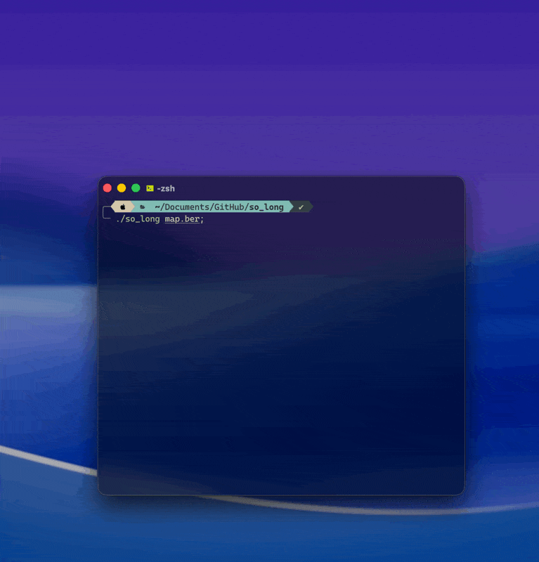
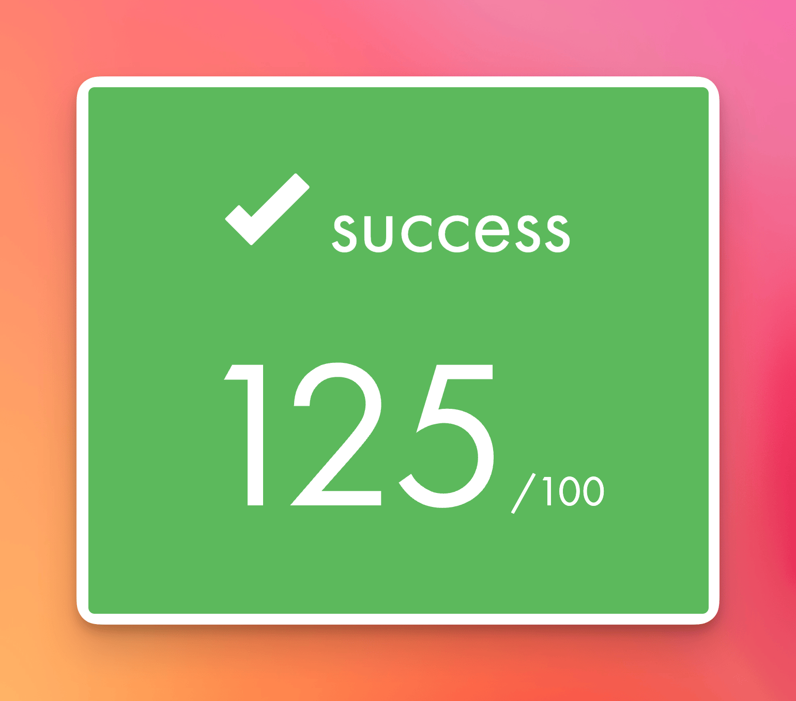

# 🎮 so_long: My First Game

[🛠️ Technologies Used](#️-technologies-used) • [📝 About the Project](#-about-the-project) • [🚀 How to Install](#-how-to-install) • [🗺️ How to Edit the Map](#️-how-to-edit-the-map) • [💬 Final Thoughts](#-final-thoughts)

<table>
	<tr>
		<td align="center">
			
		</td>
		<td align="center">
			
		</td>
	</tr>
</table>

> The graphics are bad, ok. But that was never the point of the project… so I got **125/100**. (And honestly, I’m kind of proud of my minimalist assets!)

---

## 🛠️ Technologies Used

- `C`
- `Makefile`
- `MLX42` (external graphics library, built on top of `GLFW` and `OpenGL`)

---

## 📝 About the Project

This is my very first graphical game, made for the 42 school curriculum. I started it with zero experience in graphics, and it shows… but that’s also what makes it fun! The real challenge was to make something that works, not something that’s pretty.

I have a special attachment to it. Seeing the little terminal "You Win" line with the warning message that comes with it — made the project feel even more personal to me. It’s a little rough, a little silly, but it’s 100% mine.

---


## 🚀 How to Install

Just run:

```bash
cd ~
git clone https://github.com/Bonnet2B1/so_long.git
cd so_long
make
```
That’s it! The Makefile will handle MLX42 for you. (If you’re on macOS, make sure you have Homebrew and glfw installed.)


## 🕹️ How to Play

```bash
./so_long map.ber
```
Move the player (the blue square) with **W, A, S, D** keys. Try to collect everything and reach the exit. If you see an enemy (Z)… good luck!


## 🧹 How to Uninstall

```bash
cd ~ && rm -rf so_long
```


## 🗺️ How to Edit the Map

Open `map.ber` in your favorite text editor:

```bash
open -e map.ber
```

**Map rules:**
- The map must be surrounded by walls.
- The map must be rectangular.
- The map must be doable.
- The map must have one exit (E).
- The map must have one player (P).
- The map must have at least one collectible (C).
- The map can have enemy(ies) (Z).

**Legend:**
- `0` = floor
- `1` = wall
- `P` = player
- `C` = collectible
- `E` = exit
- `Z` = enemy

Save and relaunch the game to try your new map!

---

## 💬 Final Thoughts

This project taught me a lot about graphics, Makefiles, and debugging… and about not judging a game by its cover. If you want to laugh at my assets or beat my high score, go ahead!
